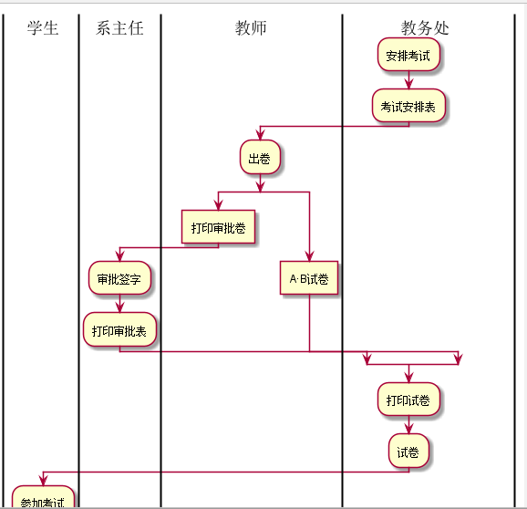
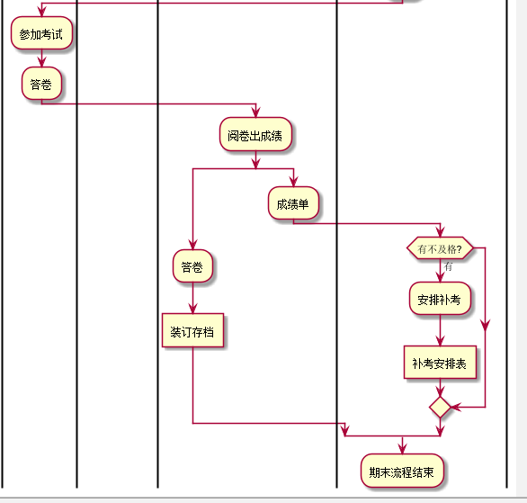
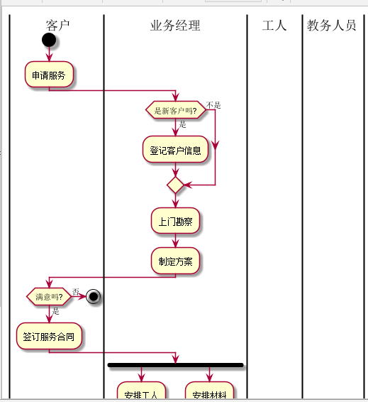
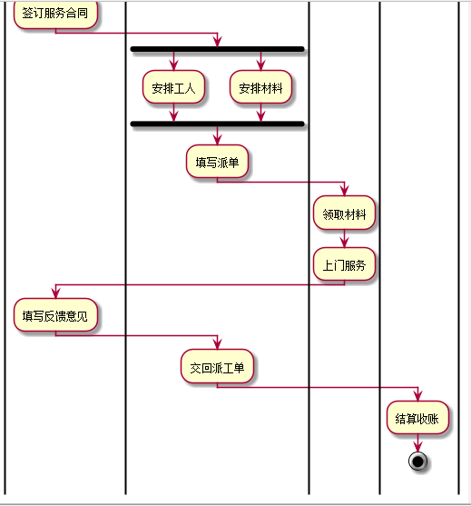

## 实验1：业务流程建模
|学号|班级|姓名|照片|
|:-------:|:-------------: | :----------:|:---:|
| 201610414317 |软件（本）16-3 |孟豪| |

## 流程图1：考试及成绩管理流程

**PlantUML源码如下：**

``` @startuml
|教务处|
start
:安排考试;
:安排考试表;
|教师|
:出卷;
fork
	:A、B试卷;
  fork again
	:打印审批表;
	end fork
|系主任|
:审批签字;
:打印审批表;

|教务处|
:打印试卷;
:试卷;
|学生|
:参加考试;
:答卷;
|教师|
:阅卷出成绩;
fork
	:成绩单;
	 fork again
	:答卷;
	end fork
	:装订存档;
	:期末流程结束;
	|教务处|
	if (有不及格？) then (yes)
     |教务处|
           :安排补考;
           :补考安排表;
endif
      |教师|
      :期末流程结束;
stop
@enduml
```

**业务流程图如下：**



**流程说明：**

期末考试前三周，教务处分则安排全校课程的考试时间和地点，下发“考试安排表”考试前一周，个任课老师准备好AB试卷，填写“试卷打印审批表”一并交予系主任审批签字，将选好的期末试卷和已签字的“试卷打印审批表”送交教务处审批部门进行打印。学生按时到达指定考场参加考试，考试完毕任课教师进行阅卷，产出成绩单，并对学生答卷装订存档。如果课程有不及格情况，教务处负责安排补考时间和地点，产生“补考安排表”，流程结束。

## 流程图2： 客户维修服务流程

**PlantUML源码如下：**
```
@startuml
|客户|
start
:申请服务;
|业务经理|
if (是新客户吗?) then (是)
  :登记客户信息;
else (不是)
endif
:上门勘察;
:制定方案;
|客户|
if (满意吗?) then (是)
  :签订服务合同;
else (否)
stop
endif
|业务经理|
fork
   :安排工人;
fork again
   :安排材料;
end fork
:填写派工单;
|工人|
:领取材料;
:上门服务;
|客户|
:验收并填写反馈意见;
|业务经理|
:交回派工单;
|财务人员|
:结算收款;
stop
@enduml
```
**业务流程图如下：**



**流程说明：**
流程从客户申请服务开始，如果是新客户，业务经理将改客户的基本信息记录下来。接下来业务经理将上门进行勘察，并制定具体“维修方案”。## 实验1：业务流程建模
|学号|班级|姓名|照片|
|:-------:|:-------------: | :----------:|:---:|
|201610414317|软件(本)16-3|孟豪||

## 流程图1：考试及成绩管理流程

**PlantUML源码如下：**

``` @startuml
|教务处|
start
:安排考试;
:安排考试表;
|教师|
:出卷;
fork
	:A、B试卷;
  fork again
	:打印审批表;
	end fork
|系主任|
:审批签字;
:打印审批表;

|教务处|
:打印试卷;
:试卷;
|学生|
:参加考试;
:答卷;
|教师|
:阅卷出成绩;
fork
	:成绩单;
	 fork again
	:答卷;
	end fork
	:装订存档;
	:期末流程结束;
	|教务处|
	if (有不及格？) then (yes)
     |教务处|
           :安排补考;
           :补考安排表;
endif
      |教师|
      :期末流程结束;
stop
@enduml
```

**业务流程图如下：**



**流程说明：**

期末考试前三周，教务处分则安排全校课程的考试时间和地点，下发“考试安排表”考试前一周，个任课老师准备好AB试卷，填写“试卷打印审批表”一并交予系主任审批签字，将选好的期末试卷和已签字的“试卷打印审批表”送交教务处审批部门进行打印。学生按时到达指定考场参加考试，考试完毕任课教师进行阅卷，产出成绩单，并对学生答卷装订存档。如果课程有不及格情况，教务处负责安排补考时间和地点，产生“补考安排表”，流程结束。

## 流程图2： 客户维修服务流程

**PlantUML源码如下：**
```
@startuml
|客户|
start
:申请服务;
|业务经理|
if (是新客户吗?) then (是)
  :登记客户信息;
else (不是)
endif
:上门勘察;
:制定方案;
|客户|
if (满意吗?) then (是)
  :签订服务合同;
else (否)
stop
endif
|业务经理|
fork
   :安排工人;
fork again
   :安排材料;
end fork
:填写派工单;
|工人|
:领取材料;
:上门服务;
|客户|
:验收并填写反馈意见;
|业务经理|
:交回派工单;
|财务人员|
:结算收款;
stop
@enduml
```
**业务流程图如下：**



**流程说明：**
流程从客户申请服务开始，如果是新客户，业务经理将改客户的基本信息记录下来。接下来业务经理将上门进行勘察，并制定具体“维修方案”。
业务经理和客户就方案进行沟通，如果达成一致，则签订正式“服务合同”，否则流程终结。根据合同方案，业务经理将对实施维修的人员和所需材料进
行计划，并填发“派工单”。工人拿到派工单后，领取指定材料上门实施服务。服务完成后客户进行验收，并在“派工单”上填写为偶像信息和反馈意见。
业务经理收回派工单后，同志财务人员进行项目结算并收款，流程结束。

....

业务经理和客户就方案进行沟通，如果达成一致，则签订正式“服务合同”，否则流程终结。根据合同方案，业务经理将对实施维修的人员和所需材料进
行计划，并填发“派工单”。工人拿到派工单后，领取指定材料上门实施服务。服务完成后客户进行验收，并在“派工单”上填写为偶像信息和反馈意见。
业务经理收回派工单后，同志财务人员进行项目结算并收款，流程结束。

....
